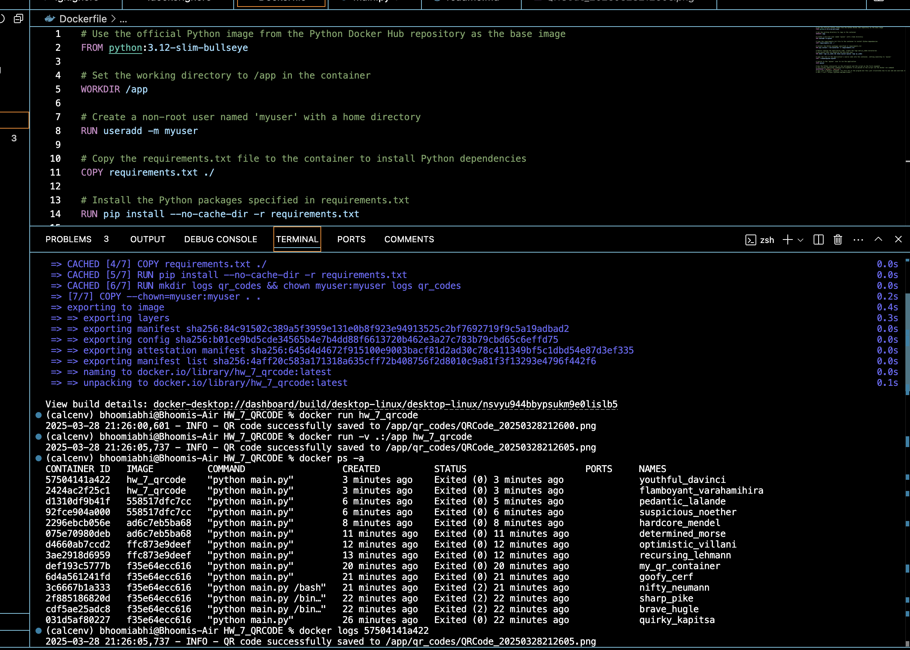

QR code Generator
Submission Requirements:

1.Add the QR code image that links to your own GitHub homepage that you generate to the readme.md file, so that it appears below.

2. Add an image of viewing the log of successfully creating the QR code below

